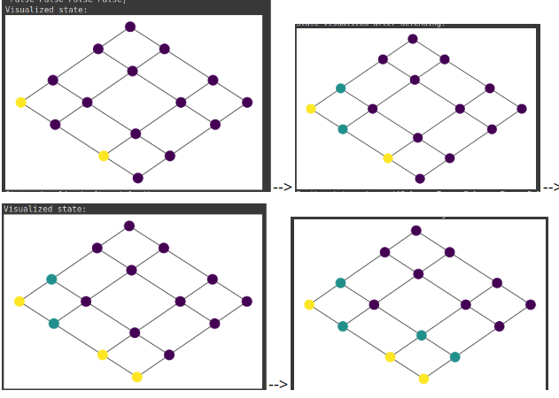
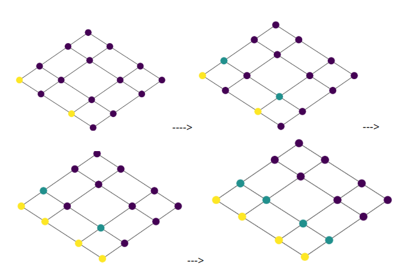

# FireFighter-RL
Implementation of some Reinforcement Learning algorithms for the Fire Fighter problem on graphs

## An Example Of Learned strategy
The model is allowed to only defend two vertices at a timestep. Blue vertices denote defended ones, yellow the burning ones and purple ones are neither burning, nor defended. 
### With burn probability 0.5

The image below shows the decisions taken by the learned model in the various states.

### With burn probability 1
Different decisions are taken by the learned agent, it decides to let the vertex in the burning row, burn, as there is 100% chance that 2 vertices will be burnt, unlike before. 

